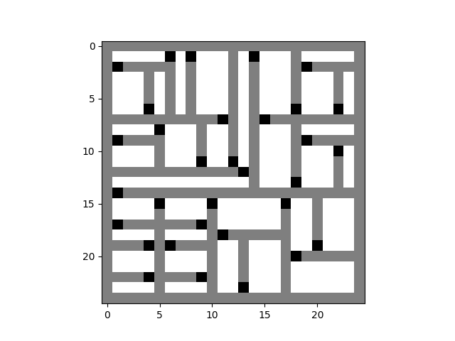
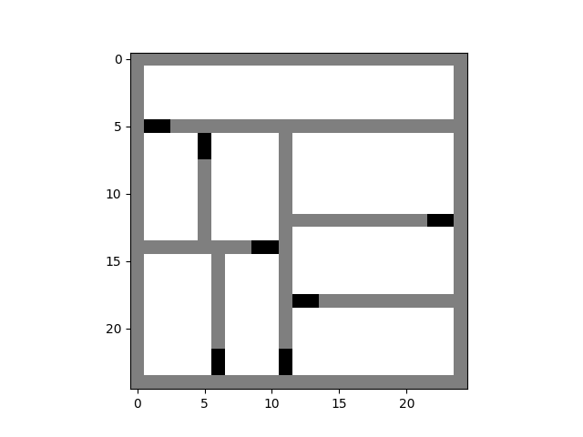
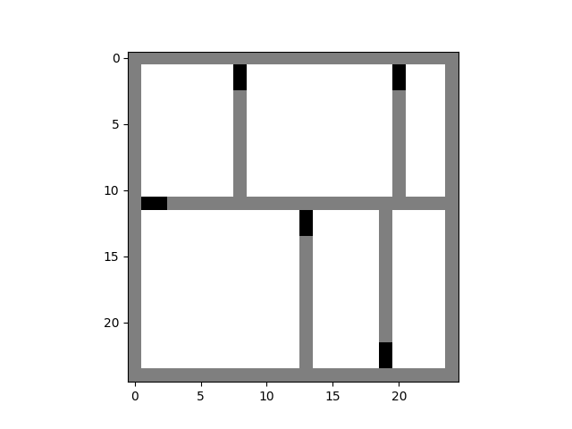

# Recursive Division Maze Generation
This Python code implements Recursive Division to generate mazes.

Here are some mazes it created at different resolutions:

Resolution = 50

Resolution = 25

Resolution = 5

It was created as a sub-project of my Final Year Project on Genetic Algorithms at University to generate training maps for the GA.

## Features
- Creates randomly generated mazes
- Garunteed path between any two points
- Variable maze resolution
- Randomly generated goals and start points

## Usage

The function simply takes two parameters, map size and map resolution. Map size is allocated when creating a the class and the resolution is then given when you populate the map.

See the example script [here](link) for more info.

## Contribution, Modification and Distribution

Feel free to use and modify this code for your mapping needs. 

If you encounter any issues or have suggestions for improvement, please open an issue or contribute to the repository.

Happy mapping!

MIT License
Copyright (c) 2024 HarGrif
